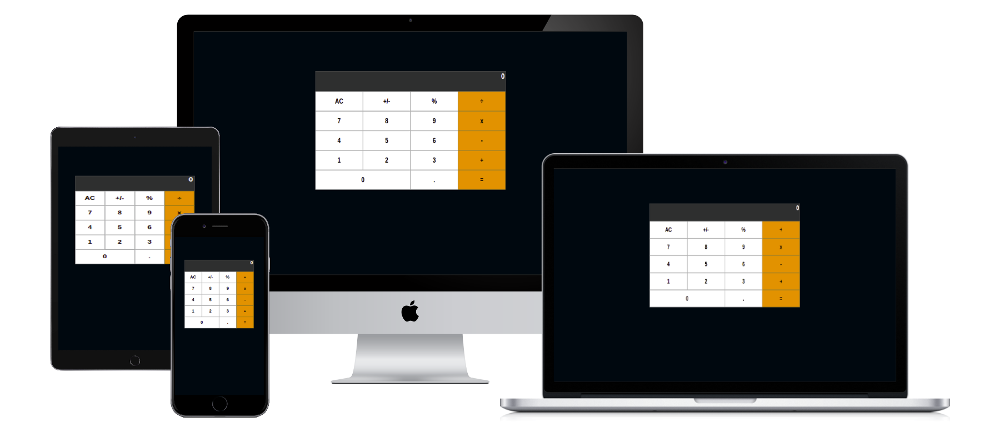

# Math magician Calculator

## Built With

- React

## Getting Started

This project was bootstrapped with [Create React App](https://github.com/facebook/create-react-app).

### Available Scripts

In the project directory, you can run:

#### `npm start`

Runs the app in the development mode.\
Open [http://localhost:3000](http://localhost:3000) to view it in your browser.

The page will reload when you make changes.\
You may also see any lint errors in the console.

#### `npm test`

Launches the test runner in the interactive watch mode.\
See the section about [running tests](https://facebook.github.io/create-react-app/docs/running-tests) for more information.

## Authors

👤 **Author1**

- GitHub: [@camilevahviraki](https://github.com/camilevahviraki)
- Twitter: [@camilevahviraki](https://twitter.com/CamileVahviraki)
- LinkedIn: [camilevahviraki](https://www.linkedin.com/in/camile-vahviraki-8180a6232/)

## 🤝 Contributing

Contributions, issues, and feature requests are welcome!

Feel free to check the [issues page](../../issues/).

## Show your support

Give a ⭐️ if you like this project!

## Acknowledgments

- Inspiration: Microverse
- React
- etc
